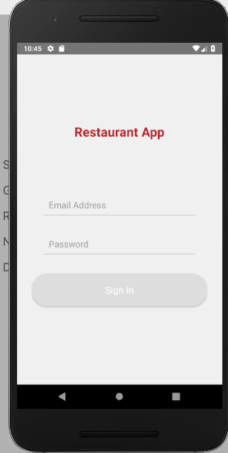
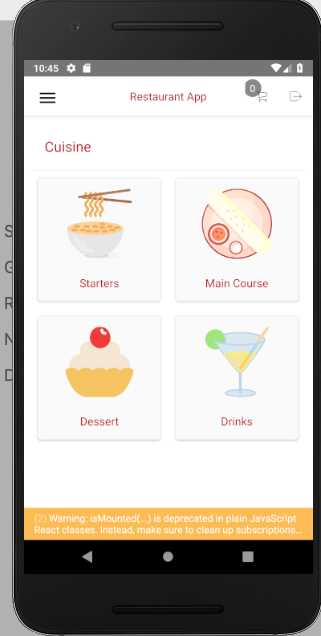
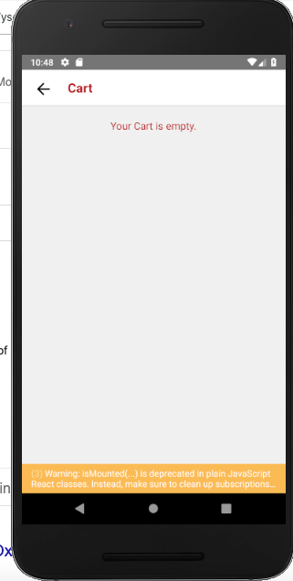
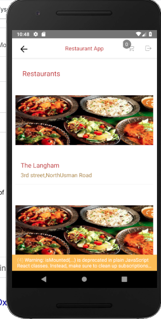
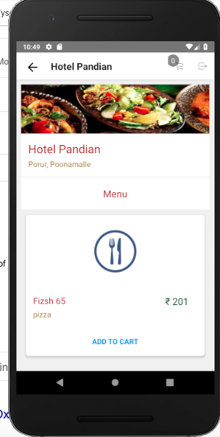
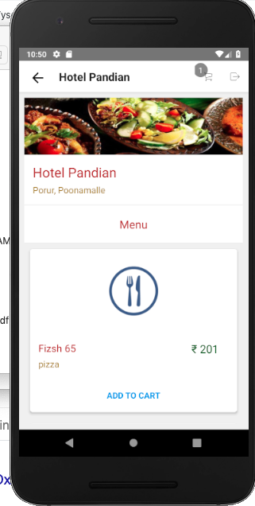
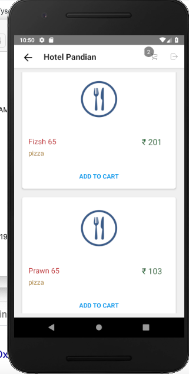
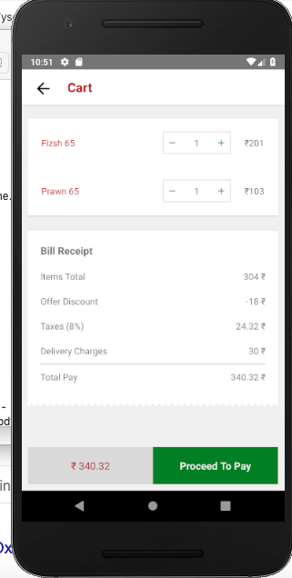

#DoodleBlue Restaurant App

TASK:
Step 1: Design the screen using the relevant icons. <br>
Screen 1 & Screen 2<br>
Step 2: When the user clicks on the menu options should be displayed: Starters, Main course, Dessert, Drinks. These are headers of each list present in view. 
Step 3: When user selecting any option it should be highlight on pop-up and at the same time in the background list respective item it should focus respective item. refer Screen 1 and Screen 2.<br>
Step 4: Initially add button will be there , After click it count button will come . It should be added up to 20 and click on (-) when the item count is 1 means it should change to add button.<br>
Screen 3<br>
Step 5: The bottom button View cart is having items count , This should be an overall count of items that have added.Refer screen 3<br>
Step 6: Click on View cart button to open a cart screen. <br>
My Cart Screen<br>
Step 7: In this screen, the total amount value is overall selected item's amount .<br> 
Step 8: Show List of Selected Items from the Previous Screen and the Item Count <br>
Step 9: First show 2 items , If the item is more than 2, display "Show more" text and when click on show more display remaining list of items, If list have only 2 items no need to show the "Show more" text.<br>
Step 10: If i change the count of the item from Cart screen , If I click on Back button, Which should reflect on Main screen and vice versa.<br>
Step 11: In Cart screen if the item count less than one, the item should be removed And In main screen that particular item count button should change into "add".<br>


I have used below technologies,

1.React -native<br>
2.Sagas<br>
3.Redux
 - Action
 - reducer
 - store<br>

### Installation

- run `npm install` or `yarn install`

### Run on Device

- run `react-native run-android`  to run on device or emulator


Main objective of this project was to have a single code base for both Android and IOS mobile apps with the logic and view separated.

#### Project Structure

```
    /android                - React native android source code
    
    /app                    - React native specific code
        /base_components    - reusable react native components
        /components         - react native components
        /screens            - connected to store components
        /App.js             - App Root component
        /router.js          - route config
        
    /assets                 - contains image and fonts
    /ios                    - React native ios source code
    
    /src
        /actions            - all redux actions
        /constants          - colors and Assets
        /reducers           - all reducers
        /sagas              - all redux sagas  
        /service            - API methods
        /store              - store config
        /utils              - some utility functions
    
```


#### ScreenShots - Android App











